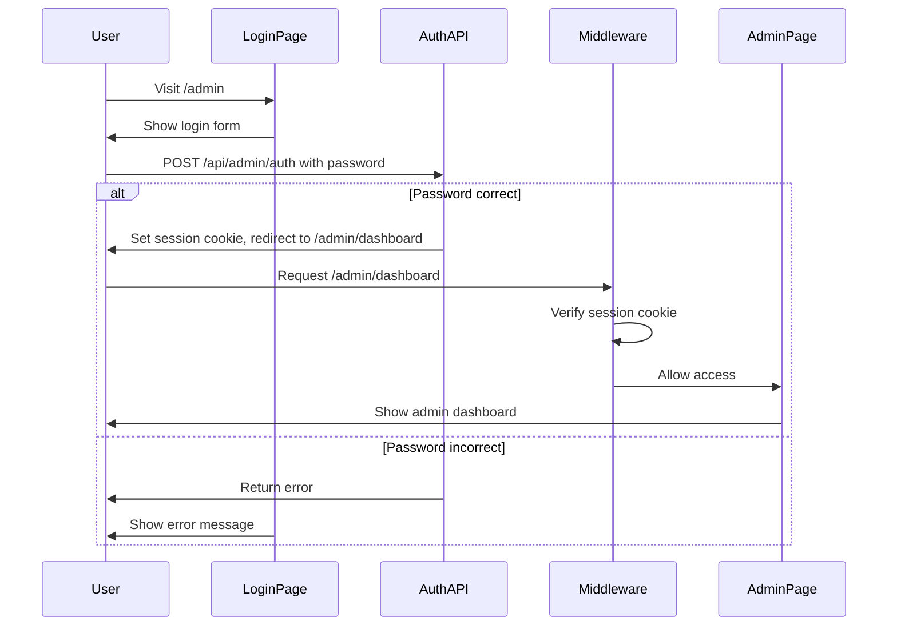

# Admin Panel Architecture Plan
## Averdi Employee & Article Management System

---

## 1. Overview

This plan outlines the architecture for a simple admin panel that allows:
1. **Employee Management** - Edit employee cards displayed on the "Om oss" page
2. **Article/Innsikt Management** - Create and edit articles with a rich text editor

### Key Decisions
- **Authentication:** Simple password protection via environment variable
- **Data Storage:** JSON files stored in the project
- **Editor:** TipTap (rich text editor based on ProseMirror)
- **No external database required**

---

## 2. Architecture Diagram

```mermaid
flowchart TB
    subgraph Client [Client Browser]
        AdminUI[Admin Panel UI]
        PublicSite[Public Website]
    end
    
    subgraph NextJS [Next.js App]
        subgraph Pages [App Router]
            AdminPages[/admin/*]
            PublicPages[Public Pages]
        end
        
        subgraph API [API Routes]
            AuthAPI[/api/admin/auth]
            EmployeesAPI[/api/admin/employees]
            ArticlesAPI[/api/admin/articles]
            UploadAPI[/api/admin/upload]
        end
        
        subgraph Middleware
            AuthMiddleware[Auth Middleware]
        end
    end
    
    subgraph Storage [File Storage]
        EmployeesJSON[data/employees.json]
        ArticlesJSON[data/articles.json]
        UploadsDir[public/uploads/]
    end
    
    AdminUI --> AuthMiddleware
    AuthMiddleware --> AdminPages
    AdminPages --> API
    API --> Storage
    PublicSite --> PublicPages
    PublicPages --> Storage
```

---

## 3. Data Models

### 3.1 Employee Model

Based on the existing [`Employee`](../Temporary/employees.ts:9) interface:

```typescript
interface Employee {
  id: string;                    // URL-safe slug, e.g., "ingvald-laiti"
  name: string;
  role: string;
  email: string;
  phone: string;
  office: string;
  description: string;           // Short description
  longDescription: string;       // Detailed bio (supports markdown)
  experience: string;            // e.g., "30+ år"
  specialties: string[];
  education: string[];
  languages: string[];
  workingHours: string;
  achievements: string[];
  clientTypes: string[];
  image?: string;                // Path to uploaded image
  relatedHubs?: RelatedHub[];
  timeline?: TimelineMilestone[];
  
  // New fields for admin
  createdAt: string;             // ISO date
  updatedAt: string;             // ISO date
  isActive: boolean;             // Show/hide on public site
  sortOrder: number;             // Display order
}
```

### 3.2 Article Model

New model for articles/innsikt:

```typescript
interface Article {
  id: string;                    // URL-safe slug
  title: string;
  subtitle?: string;
  excerpt: string;               // Short description for cards
  content: string;               // HTML from rich text editor
  
  // Metadata
  category: ArticleCategory;
  tags: string[];
  readTime: number;              // Minutes
  
  // Author
  authorId: string;              // Reference to employee
  
  // Media
  featuredImage?: string;
  featuredImageAlt?: string;
  
  // SEO
  metaTitle?: string;
  metaDescription?: string;
  
  // Status
  status: 'draft' | 'published';
  publishedAt?: string;
  createdAt: string;
  updatedAt: string;
  
  // Display
  isFeatured: boolean;
  sortOrder: number;
}

type ArticleCategory = 
  | 'bedrift'
  | 'sametinget'
  | 'organisasjoner'
  | 'analyse'
  | 'regelverk';
```

---

## 4. Authentication System

### 4.1 Simple Password Protection

Using Next.js middleware with a session cookie:

```
Environment Variable:
ADMIN_PASSWORD=your-secure-password-here
```

### 4.2 Auth Flow



### 4.3 Session Management

- Session stored in HTTP-only cookie
- Cookie expires after 24 hours
- Simple JWT or signed cookie (no database needed)

---

## 5. API Routes

### 5.1 Authentication

| Method | Endpoint | Description |
|--------|----------|-------------|
| POST | `/api/admin/auth` | Login with password |
| POST | `/api/admin/auth/logout` | Clear session |
| GET | `/api/admin/auth/check` | Verify session |

### 5.2 Employees

| Method | Endpoint | Description |
|--------|----------|-------------|
| GET | `/api/admin/employees` | List all employees |
| GET | `/api/admin/employees/[id]` | Get single employee |
| POST | `/api/admin/employees` | Create employee |
| PUT | `/api/admin/employees/[id]` | Update employee |
| DELETE | `/api/admin/employees/[id]` | Delete employee |
| PATCH | `/api/admin/employees/reorder` | Update sort order |

### 5.3 Articles

| Method | Endpoint | Description |
|--------|----------|-------------|
| GET | `/api/admin/articles` | List all articles |
| GET | `/api/admin/articles/[id]` | Get single article |
| POST | `/api/admin/articles` | Create article |
| PUT | `/api/admin/articles/[id]` | Update article |
| DELETE | `/api/admin/articles/[id]` | Delete article |
| PATCH | `/api/admin/articles/[id]/publish` | Publish/unpublish |

### 5.4 File Upload

| Method | Endpoint | Description |
|--------|----------|-------------|
| POST | `/api/admin/upload` | Upload image |
| DELETE | `/api/admin/upload/[filename]` | Delete image |

---

## 6. File Structure

```
src/
├── app/
│   ├── admin/
│   │   ├── layout.tsx              # Admin layout with sidebar
│   │   ├── page.tsx                # Redirect to dashboard or login
│   │   ├── login/
│   │   │   └── page.tsx            # Login page
│   │   ├── dashboard/
│   │   │   └── page.tsx            # Dashboard overview
│   │   ├── employees/
│   │   │   ├── page.tsx            # Employee list
│   │   │   ├── new/
│   │   │   │   └── page.tsx        # Create employee
│   │   │   └── [id]/
│   │   │       └── page.tsx        # Edit employee
│   │   └── articles/
│   │       ├── page.tsx            # Article list
│   │       ├── new/
│   │       │   └── page.tsx        # Create article
│   │       └── [id]/
│   │           └── page.tsx        # Edit article
│   │
│   └── api/
│       └── admin/
│           ├── auth/
│           │   └── route.ts        # Auth endpoints
│           ├── employees/
│           │   ├── route.ts        # List/Create
│           │   └── [id]/
│           │       └── route.ts    # Get/Update/Delete
│           ├── articles/
│           │   ├── route.ts        # List/Create
│           │   └── [id]/
│           │       └── route.ts    # Get/Update/Delete
│           └── upload/
│               └── route.ts        # File upload
│
├── components/
│   └── admin/
│       ├── AdminLayout.tsx         # Sidebar + header
│       ├── AdminSidebar.tsx        # Navigation sidebar
│       ├── AdminHeader.tsx         # Top header with logout
│       ├── EmployeeForm.tsx        # Employee edit form
│       ├── ArticleForm.tsx         # Article edit form
│       ├── RichTextEditor.tsx      # TipTap editor wrapper
│       ├── ImageUploader.tsx       # Drag-drop image upload
│       ├── DataTable.tsx           # Reusable data table
│       └── ConfirmDialog.tsx       # Delete confirmation
│
├── lib/
│   ├── admin/
│   │   ├── auth.ts                 # Auth utilities
│   │   ├── employees.ts            # Employee CRUD functions
│   │   ├── articles.ts             # Article CRUD functions
│   │   └── upload.ts               # File upload utilities
│   └── utils.ts                    # Existing utilities
│
└── data/
    ├── employees.json              # Employee data (moved from Temporary/)
    └── articles.json               # Article data

public/
└── uploads/
    ├── employees/                  # Employee profile images
    └── articles/                   # Article images

middleware.ts                       # Auth middleware for /admin routes
```

---

## 7. UI Components

### 7.1 Admin Layout

```
┌─────────────────────────────────────────────────────────────┐
│  🟠 Averdi Admin                              [Logg ut]     │
├──────────────┬──────────────────────────────────────────────┤
│              │                                              │
│  Dashboard   │                                              │
│              │         Main Content Area                    │
│  Ansatte     │                                              │
│  • Liste     │         (Employee list, forms, etc.)         │
│  • Ny        │                                              │
│              │                                              │
│  Artikler    │                                              │
│  • Liste     │                                              │
│  • Ny        │                                              │
│              │                                              │
└──────────────┴──────────────────────────────────────────────┘
```

### 7.2 Employee List View

```
┌─────────────────────────────────────────────────────────────┐
│  Ansatte                                    [+ Ny ansatt]   │
├─────────────────────────────────────────────────────────────┤
│  🔍 Søk...                                                  │
├─────────────────────────────────────────────────────────────┤
│  ☰  │ Bilde │ Navn              │ Rolle        │ Handlinger │
├─────┼───────┼───────────────────┼──────────────┼────────────┤
│  ≡  │  👤   │ Ingvald Laiti     │ Daglig leder │ ✏️ 🗑️      │
│  ≡  │  👤   │ Jan Atle Guttorm  │ Regnskapsfør │ ✏️ 🗑️      │
│  ≡  │  👤   │ Hilde M. Laiti    │ Regnskapsfør │ ✏️ 🗑️      │
└─────┴───────┴───────────────────┴──────────────┴────────────┘
```

### 7.3 Employee Edit Form

```
┌─────────────────────────────────────────────────────────────┐
│  ← Tilbake til liste                                        │
│                                                             │
│  Rediger ansatt: Ingvald Laiti                              │
├─────────────────────────────────────────────────────────────┤
│                                                             │
│  ┌─────────────┐  Navn *                                    │
│  │             │  [Ingvald Laiti                    ]       │
│  │   📷 Last   │                                            │
│  │    opp      │  Rolle *                                   │
│  │             │  [Daglig leder / Statsautorisert...  ]     │
│  └─────────────┘                                            │
│                                                             │
│  E-post *                        Telefon *                  │
│  [ingvald.laiti@averdi.no  ]    [907 67 993           ]     │
│                                                             │
│  Kort beskrivelse *                                         │
│  [Spesialist på regnskap for samiske organisasjoner...  ]   │
│                                                             │
│  Lang beskrivelse                                           │
│  ┌─────────────────────────────────────────────────────┐   │
│  │ B I U │ H1 H2 │ • │ 🔗 │                            │   │
│  ├─────────────────────────────────────────────────────┤   │
│  │ Som grunnlegger av Averdi har Ingvald over 30 års  │   │
│  │ erfaring med næringslivet i Finnmark...            │   │
│  └─────────────────────────────────────────────────────┘   │
│                                                             │
│  Spesialområder (kommaseparert)                             │
│  [Samiske organisasjoner, Offentlig tilskudd, ...]          │
│                                                             │
│                              [Avbryt]  [Lagre endringer]    │
└─────────────────────────────────────────────────────────────┘
```

### 7.4 Article Editor

```
┌─────────────────────────────────────────────────────────────┐
│  ← Tilbake til liste                    [Forhåndsvis] [Lagre]│
│                                                             │
│  Ny artikkel                                                │
├─────────────────────────────────────────────────────────────┤
│                                                             │
│  Tittel *                                                   │
│  [Sosioøkonomiske forskjeller uten at samfunnet ser det ]   │
│                                                             │
│  Undertittel                                                │
│  [En analyse av statsbudsjettet 2026                    ]   │
│                                                             │
│  ┌─────────────────────────────────────────────────────┐   │
│  │ B I U │ H1 H2 H3 │ • 1. │ " │ 🔗 📷 │ </> │        │   │
│  ├─────────────────────────────────────────────────────┤   │
│  │                                                     │   │
│  │  Mens Norge diskuterer strømpriser, betaler        │   │
│  │  befolkningen i nord en usynlig skatt...           │   │
│  │                                                     │   │
│  │  ## Bakgrunn                                        │   │
│  │                                                     │   │
│  │  I 2024 la regjeringen frem et statsbudsjett som   │   │
│  │  på overflaten virket balansert...                 │   │
│  │                                                     │   │
│  └─────────────────────────────────────────────────────┘   │
│                                                             │
│  ┌─ Metadata ─────────────────────────────────────────┐    │
│  │ Kategori: [Analyse      ▼]  Lesetid: [15] min      │    │
│  │ Forfatter: [Ingvald Laiti ▼]                       │    │
│  │ Status: ○ Utkast  ● Publisert                      │    │
│  │ Fremhevet: ☑                                       │    │
│  └────────────────────────────────────────────────────┘    │
│                                                             │
└─────────────────────────────────────────────────────────────┘
```

---

## 8. Rich Text Editor (TipTap)

### 8.1 Why TipTap?

- **Headless:** Full control over styling (matches Averdi design)
- **Extensible:** Easy to add custom features
- **Modern:** Based on ProseMirror, actively maintained
- **Free:** MIT license

### 8.2 Features to Include

| Feature | Description |
|---------|-------------|
| **Text Formatting** | Bold, italic, underline, strikethrough |
| **Headings** | H1, H2, H3 |
| **Lists** | Bullet lists, numbered lists |
| **Blockquotes** | For highlighting quotes |
| **Links** | Insert/edit hyperlinks |
| **Images** | Upload and embed images |
| **Code Blocks** | For technical content |
| **Tables** | Basic table support |

### 8.3 Required Packages

```bash
npm install @tiptap/react @tiptap/starter-kit @tiptap/extension-image @tiptap/extension-link @tiptap/extension-placeholder
```

---

## 9. Implementation Order

### Phase 1: Foundation
1. Set up data files (move employees.ts to JSON)
2. Create auth middleware and login page
3. Create admin layout with sidebar

### Phase 2: Employee Management
4. Build employee list page with data table
5. Build employee edit form
6. Implement employee API routes
7. Add image upload for employee photos

### Phase 3: Article Management
8. Build article list page
9. Integrate TipTap rich text editor
10. Build article edit form
11. Implement article API routes
12. Add image upload for articles

### Phase 4: Polish
13. Add drag-and-drop reordering
14. Add search/filter functionality
15. Add confirmation dialogs
16. Test and fix edge cases

---

## 10. Security Considerations

### 10.1 Implemented

- ✅ Password stored in environment variable (not in code)
- ✅ HTTP-only session cookie (prevents XSS)
- ✅ Middleware protection for all /admin routes
- ✅ CSRF protection via SameSite cookie

### 10.2 Limitations (Acceptable for Single Admin)

- ⚠️ No rate limiting on login attempts
- ⚠️ No password reset functionality
- ⚠️ No audit logging
- ⚠️ Single shared password (no user accounts)

### 10.3 Recommendations for Future

If you need multi-user support later, consider:
- Upgrading to Supabase or Firebase Auth
- Adding role-based access control
- Implementing audit logging

---

## 11. Migration Plan

### 11.1 Employee Data Migration

Current location: [`Temporary/employees.ts`](../Temporary/employees.ts)
New location: `src/data/employees.json`

Steps:
1. Convert TypeScript object to JSON format
2. Add new fields (createdAt, updatedAt, isActive, sortOrder)
3. Update imports in existing components
4. Delete old Temporary folder

### 11.2 Article Data Migration

Current: Hardcoded in page files
New: `src/data/articles.json`

Steps:
1. Create initial articles.json with existing content
2. Create dynamic article page that reads from JSON
3. Keep old static pages as fallback during transition

---

## 12. Dependencies to Add

```json
{
  "dependencies": {
    "@tiptap/react": "^2.x",
    "@tiptap/starter-kit": "^2.x",
    "@tiptap/extension-image": "^2.x",
    "@tiptap/extension-link": "^2.x",
    "@tiptap/extension-placeholder": "^2.x",
    "jose": "^5.x"
  }
}
```

- **TipTap packages:** Rich text editor
- **jose:** JWT handling for session tokens (lightweight, no dependencies)

---

## 13. Summary

| Feature | Approach |
|---------|----------|
| **Authentication** | Simple password + session cookie |
| **Data Storage** | JSON files in project |
| **Employee Editing** | Form with image upload |
| **Article Editing** | TipTap WYSIWYG editor |
| **File Uploads** | Store in public/uploads/ |
| **Styling** | Matches existing Averdi design system |

### Pros of This Approach
- ✅ No external services or databases needed
- ✅ Works with static hosting (Vercel, Netlify)
- ✅ Simple to understand and maintain
- ✅ Fast to implement

### Cons / Limitations
- ⚠️ Single admin only (shared password)
- ⚠️ No version history for content
- ⚠️ File uploads limited by hosting provider
- ⚠️ Not suitable for high-traffic editing

---

**Ready to proceed?** Once you approve this plan, I can switch to Code mode and begin implementation.
