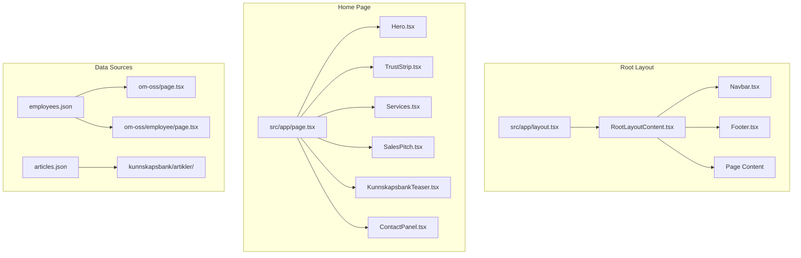
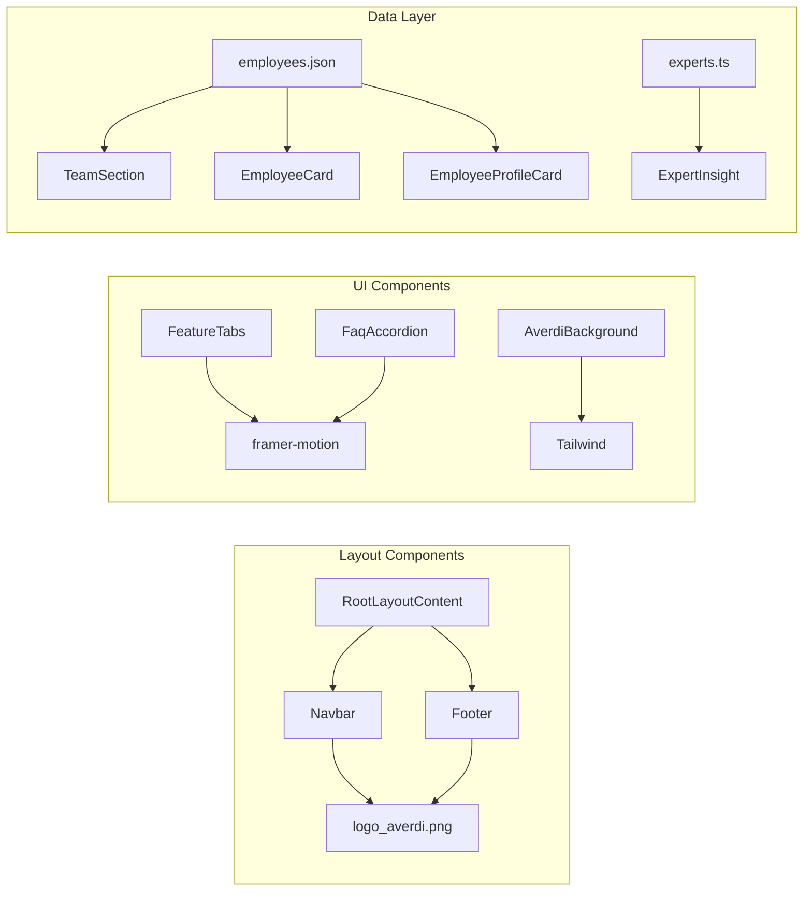

# Averdi NextJS Project - File Cleanup Report
## Manual Cleanup Guide

---

## 📊 Project Overview

This is a **Next.js 15** project for Averdi, an accounting firm in Northern Norway. The project uses:
- **Framework:** Next.js (App Router)
- **Language:** TypeScript
- **Styling:** Tailwind CSS
- **Animation:** Framer Motion
- **Icons:** Lucide React

---

## 🚨 CRITICAL: Duplicate/Redundant Files

### 1. Employee Data Files (HIGH PRIORITY)

There are **4 different employee data sources** that contain the same information:

| File | Location | Format | Status |
|------|----------|--------|--------|
| [`employees.json`](src/data/employees.json) | `src/data/` | JSON | ✅ KEEP (Primary) |
| [`employees.ts`](src/data/employees.ts) | `src/data/` | TypeScript | ⚠️ DUPLICATE |
| [`experts.ts`](src/data/experts.ts) | `src/data/` | TypeScript | ⚠️ DIFFERENT SCHEMA |
| [`employees.ts`](Temporary/employees.ts) | `Temporary/` | TypeScript | ❌ DELETE |

**Recommendation:**
- Keep [`src/data/employees.json`](src/data/employees.json) as the single source of truth
- Delete [`src/data/employees.ts`](src/data/employees.ts) - it's an exact duplicate of the JSON
- Review [`src/data/experts.ts`](src/data/experts.ts) - has different schema with fewer fields, may be legacy
- Delete [`Temporary/employees.ts`](Temporary/employees.ts) - duplicate in temp folder

### 2. Calculator Components (MEDIUM PRIORITY)

Two nearly identical calculator components exist:

| File | Lines | Status |
|------|-------|--------|
| [`fil1.tsx`](src/components/tools/fil1.tsx) | 464 | More complete version |
| [`fil2.tsx`](src/components/tools/fil2.tsx) | 263 | Simpler version |
| [`InnsatssoneCalculator.tsx`](src/components/tools/InnsatssoneCalculator.tsx) | Unknown | May be the production version |

**Recommendation:**
- Check which calculator is actually used in production
- Delete the unused versions
- Rename `fil1.tsx` and `fil2.tsx` to meaningful names if keeping

### 3. AverdiBackground Component (LOW PRIORITY)

Duplicate component in two locations:

| File | Location |
|------|----------|
| [`AverdiBackground.tsx`](src/components/modules/AverdiBackground.tsx) | `src/components/modules/` |
| [`AverdiBackground.tsx`](src/components/ui/AverdiBackground.tsx) | `src/components/ui/` |

**Recommendation:** Keep one, delete the other. Check imports to determine which is used.

---

## 📁 Folders to Review for Deletion

### 1. `newest/` Folder - ❌ LIKELY DELETE

Contains what appears to be experimental/draft code:

```
newest/
├── page.tsx
├── README.md
├── service.ts
├── ServicePageLayout.tsx
├── Services.tsx
└── mnt/user-data/outputs/nextjs-services/app/tjenester/
    ├── fakturering/page.tsx
    ├── lonn/page.tsx
    └── raadgiving/page.tsx
```

**Analysis:**
- The `mnt/user-data/outputs/` path suggests this was generated by an AI tool
- Contains service pages that may have been integrated into main `src/app/tjenester/`
- Compare with existing [`src/app/tjenester/`](src/app/tjenester/) to verify

### 2. `Temporary/` Folder - ❌ DELETE

Contains old/experimental files:

```
Temporary/
├── EmployeeProfilePage.tsx    → Likely integrated into src/app/om-oss/[employee]/
├── employees.ts               → Duplicate of src/data/employees.ts
├── index.html                 → Unknown purpose
├── TeamPage.tsx               → Likely integrated into src/app/om-oss/
└── ex/
    ├── Bedrifskalkulatorsone4.html
    └── ex2.html
```

### 3. Root-level Orphan Files - ⚠️ REVIEW

| File | Purpose | Recommendation |
|------|---------|----------------|
| [`index.html`](index.html) | Static HTML fallback? | ❌ DELETE if not needed |
| [`.nojekyll`](.nojekyll) | GitHub Pages config | ❌ DELETE if not using GH Pages |
| [`.gitnore`](.gitnore) | Typo of .gitignore | ❌ DELETE (duplicate with typo) |
| [`test-routing-debug.js`](test-routing-debug.js) | Debug script | ❌ DELETE after testing |

---

## 🔗 File Connection Map

### Core Application Flow



### Component Dependencies



---

## 📂 Folder Structure Analysis

### Active Source Code (`src/`)

```
src/
├── app/                    # Next.js App Router pages
│   ├── admin/              # Admin panel (protected)
│   ├── api/                # API routes
│   ├── kunnskapsbank/      # Knowledge base pages
│   ├── om-oss/             # About us / Team pages
│   ├── team-demo/          # ⚠️ Demo page - review if needed
│   └── tjenester/          # Service pages
├── assets/                 # Images and static files
├── components/
│   ├── admin/              # Admin-specific components
│   ├── analytics/          # Hotjar tracking
│   ├── layout/             # Navbar, Footer, RootLayoutContent
│   ├── modules/            # Feature modules
│   │   ├── about/          # Team/employee components
│   │   ├── home/           # Homepage sections
│   │   ├── kunnskapsbank/  # Knowledge base components
│   │   └── services/       # Service page components
│   ├── tools/              # Calculators (needs cleanup)
│   └── ui/                 # Reusable UI components
├── data/                   # JSON/TS data files (needs cleanup)
├── lib/                    # Utility functions
└── types/                  # TypeScript type definitions
```

### Non-Source Folders

| Folder | Purpose | Action |
|--------|---------|--------|
| `docs/` | Documentation | ✅ KEEP |
| `kostnadsanalyse/` | Cost analysis PDFs | ✅ KEEP (business docs) |
| `plans/` | Planning documents | ✅ KEEP |
| `public/` | Static assets | ✅ KEEP |
| `Research/` | Research documents | ✅ KEEP (reference) |
| `rules/` | Styling rules | ⚠️ REVIEW - may be duplicate of .kilocode/rules |
| `screenshots/` | Test screenshots | ⚠️ REVIEW - delete if not needed |
| `newest/` | Experimental code | ❌ DELETE |
| `Temporary/` | Temp files | ❌ DELETE |

---

## 🔍 Detailed File Analysis

### Assets Folder (`src/assets/`)

**Potential duplicates:**

| File 1 | File 2 | Action |
|--------|--------|--------|
| `karasjok_Over.avif` | `karasjok_Over-DxPgVcEF.avif` | Check if both used |
| `logo_averdi.avif` | `logo_averdi.png` | Keep one format |
| `Logo_sameting_logo_3d_hvit.avif` | `Logo_sameting_logo_3d_hvit.png` | Keep one format |

**Unused assets to verify:**
- `Logo_poweroffice.jpg` - may be replaced by `.avif` version
- `regnskapnorgemedledd_gra.webp` - check if used

### Data Files (`src/data/`)

| File | Used By | Status |
|------|---------|--------|
| `agaData.ts` | Calculator components | ✅ KEEP |
| `articles.json` | Admin panel, artikler pages | ✅ KEEP |
| `calculatorData.ts` | Calculator components | ✅ KEEP |
| `employees.json` | Team pages, admin | ✅ KEEP (Primary) |
| `employees.ts` | Duplicate of JSON | ❌ DELETE |
| `experts.ts` | ExpertInsight component | ⚠️ REVIEW |
| `propertyTaxData.ts` | Calculator | ✅ KEEP |

---

## ✅ Cleanup Checklist

### Phase 1: Safe Deletions (No Risk)

- [ ] Delete `Temporary/` folder entirely
- [ ] Delete `.gitnore` (typo file)
- [ ] Delete `newest/` folder after verifying content not needed
- [ ] Delete root `index.html` if not used
- [ ] Delete root `.nojekyll` if not using GitHub Pages

### Phase 2: Consolidate Data (Medium Risk)

- [ ] Delete `src/data/employees.ts` (keep `employees.json`)
- [ ] Review `src/data/experts.ts` - merge into employees.json or delete
- [ ] Update any imports from `employees.ts` to use JSON

### Phase 3: Component Cleanup (Higher Risk)

- [ ] Identify which calculator is production (`fil1.tsx`, `fil2.tsx`, or `InnsatssoneCalculator.tsx`)
- [ ] Delete unused calculator versions
- [ ] Rename remaining calculator to meaningful name
- [ ] Consolidate `AverdiBackground.tsx` to single location

### Phase 4: Asset Optimization

- [ ] Remove duplicate image formats (keep .avif, delete .png/.jpg)
- [ ] Verify all assets are actually used
- [ ] Consider moving unused assets to archive folder

---

## 📋 Import Dependencies to Update

If you delete `src/data/employees.ts`, update these files:

```typescript
// Files that may import from employees.ts:
// - src/app/om-oss/page.tsx
// - src/app/om-oss/[employee]/page.tsx
// - src/components/modules/about/TeamSection.tsx
// - src/lib/admin/employees.ts

// Change from:
import { employees } from '@/data/employees';

// To:
import employeesData from '@/data/employees.json';
const employees = employeesData as EmployeesData;
```

---

## 🎯 Priority Summary

| Priority | Action | Files Affected |
|----------|--------|----------------|
| 🔴 HIGH | Delete Temporary folder | 6 files |
| 🔴 HIGH | Delete newest folder | 8+ files |
| 🟡 MEDIUM | Consolidate employee data | 3 files |
| 🟡 MEDIUM | Clean up calculators | 3 files |
| 🟢 LOW | Remove duplicate assets | ~5 files |
| 🟢 LOW | Delete test files | 2-3 files |

---

## ⚠️ Before Deleting

1. **Backup:** Create a git commit or branch before cleanup
2. **Search:** Use `grep` or IDE search to find all imports of files you plan to delete
3. **Test:** Run `npm run build` after each deletion phase to catch broken imports
4. **Verify:** Check the live site after deployment

---

*Report generated: 2026-01-30*
*Project: averdiNextJS*
