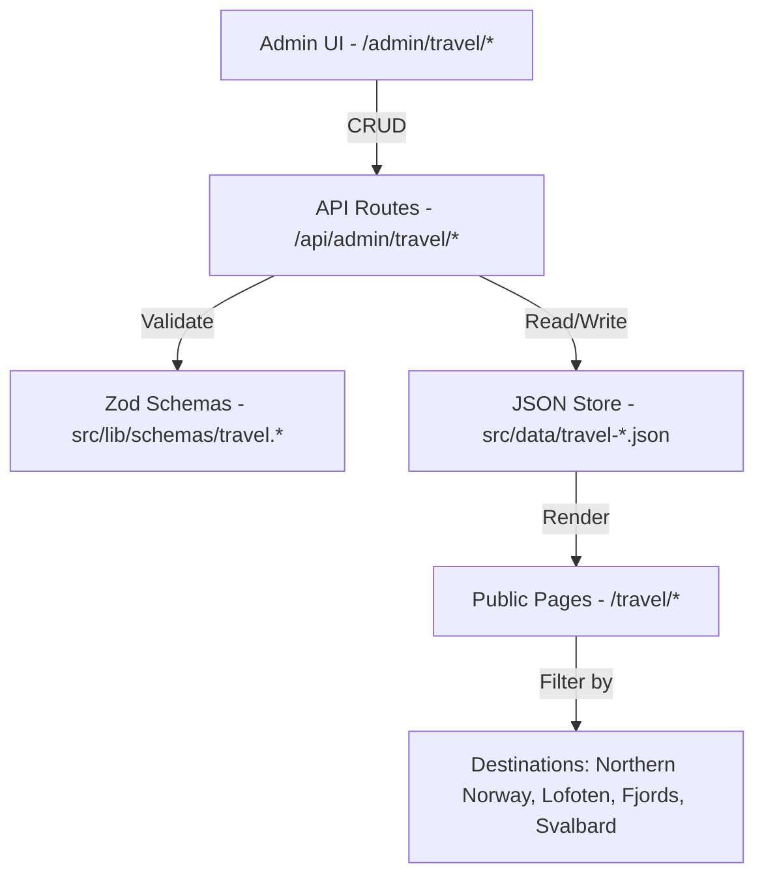
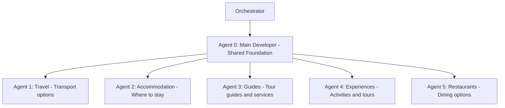
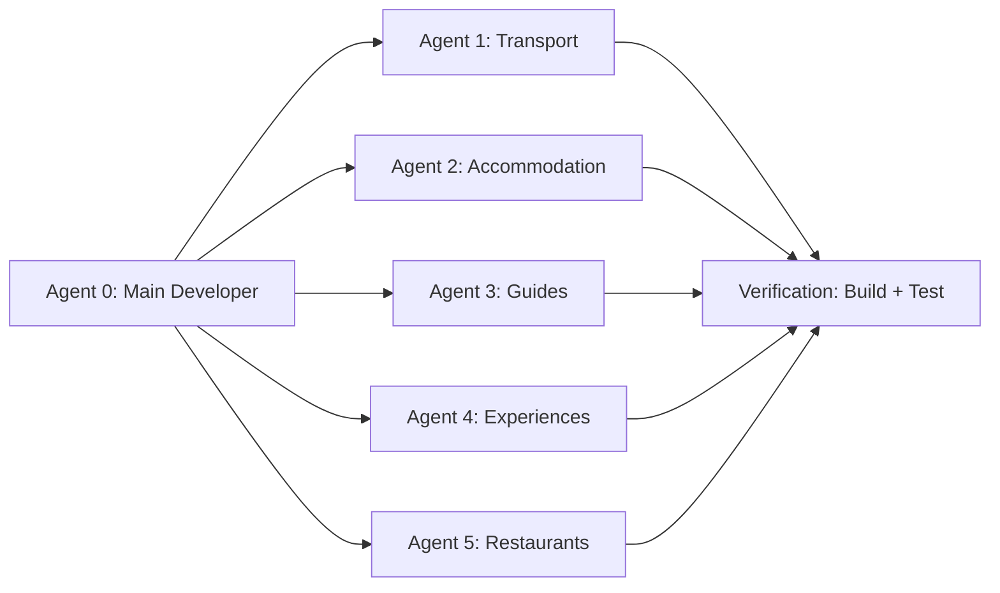

# NorgeTravel — Travel Mapping Multi-Agent Plan

## Overview

Build a comprehensive travel mapping system for Norway using the existing admin CRUD pattern (JSON data store + Zod schemas + API routes + admin UI). The system covers **5 travel categories**, each developed by a dedicated Kilo Code orchestrator subtask agent. A **main developer agent** creates the shared foundation first, then individual agents build out each category.

---

## Architecture

### Data Flow



### Agent Architecture



---

## Agent 0: Main Developer — Shared Foundation

This agent builds the reusable infrastructure that all 5 category agents depend on.

### Tasks

1. **Create shared destination enum** — `src/lib/schemas/travel.shared.ts`
   - Destination enum: `northern-norway`, `lofoten`, `fjords`, `svalbard`
   - Shared base schema fields: `id`, `name`, `description`, `destination`, `location`, `priceRange`, `website`, `imageUrl`, `imageAlt`, `status`, `isFeatured`, `sortOrder`, `createdAt`, `updatedAt`
   - Price range enum: `budget`, `mid-range`, `luxury`, `varies`

2. **Create travel JSON store factory** — `src/lib/admin/travel-base.ts`
   - Reusable CRUD functions following the pattern in `src/lib/admin/articles.ts`
   - Generic `getTravelItems()`, `getTravelItem()`, `createTravelItem()`, `updateTravelItem()`, `deleteTravelItem()`
   - Filter helper: `filterByDestination()`

3. **Create admin layout for travel section** — `src/app/admin/travel/layout.tsx`
   - Sub-navigation with tabs for each category
   - Follows existing admin layout pattern from `src/components/admin/AdminSidebar.tsx`

4. **Create shared admin components**
   - `src/components/admin/travel/TravelItemForm.tsx` — Base form with shared fields
   - `src/components/admin/travel/TravelItemList.tsx` — Reusable list/table component
   - `src/components/admin/travel/DestinationFilter.tsx` — Dropdown filter by destination

5. **Create shared public page components**
   - `src/components/modules/travel/TravelHero.tsx` — Category hero section
   - `src/components/modules/travel/TravelGrid.tsx` — Card grid with destination filtering
   - `src/components/modules/travel/TravelCard.tsx` — Individual item card
   - `src/components/modules/travel/TravelFilters.tsx` — Public-facing filter bar

6. **Create travel index page** — `src/app/travel/page.tsx`
   - Overview page linking to all 5 categories
   - Follows the pattern of `src/app/destinations/page.tsx`

7. **Update navigation** — Add "Travel Map" to navbar with dropdown for 5 categories

8. **Initialize empty JSON data files**
   - `src/data/travel-transport.json`
   - `src/data/travel-accommodation.json`
   - `src/data/travel-guides.json`
   - `src/data/travel-experiences.json`
   - `src/data/travel-restaurants.json`

---

## Agent 1: Travel — Transport Options

### Schema: `src/lib/schemas/travel.transport.schema.ts`

| Field | Type | Description |
|-------|------|-------------|
| *...base fields* | — | Inherited from shared schema |
| `transportType` | enum | `fly`, `train`, `bus`, `ferry`, `car-rental`, `bicycle` |
| `operator` | string | Company name |
| `routeFrom` | string | Departure point |
| `routeTo` | string | Arrival point |
| `duration` | string | Estimated travel time |
| `frequency` | string | How often it runs |
| `bookingUrl` | string | Where to book |
| `isEcoFriendly` | boolean | Zero-emission or sustainable |
| `seasonalAvailability` | string | When available |

### Files to Create

- `src/lib/schemas/travel.transport.schema.ts`
- `src/lib/admin/travel-transport.ts`
- `src/app/api/admin/travel/transport/route.ts`
- `src/app/admin/travel/transport/page.tsx`
- `src/app/admin/travel/transport/new/page.tsx`
- `src/app/travel/transport/page.tsx`

---

## Agent 2: Accommodation — Where to Stay

### Schema: `src/lib/schemas/travel.accommodation.schema.ts`

| Field | Type | Description |
|-------|------|-------------|
| *...base fields* | — | Inherited from shared schema |
| `accommodationType` | enum | `hotel`, `cabin`, `hostel`, `camping`, `rorbu`, `glamping`, `apartment` |
| `starRating` | number | 1-5 stars, nullable |
| `amenities` | string[] | WiFi, sauna, kitchen, etc. |
| `capacity` | string | Number of guests |
| `checkIn` | string | Check-in time |
| `checkOut` | string | Check-out time |
| `bookingUrl` | string | Where to book |
| `isEcoFriendly` | boolean | Eco-certified |
| `nearestTown` | string | Closest town/village |

### Files to Create

- `src/lib/schemas/travel.accommodation.schema.ts`
- `src/lib/admin/travel-accommodation.ts`
- `src/app/api/admin/travel/accommodation/route.ts`
- `src/app/admin/travel/accommodation/page.tsx`
- `src/app/admin/travel/accommodation/new/page.tsx`
- `src/app/travel/accommodation/page.tsx`

---

## Agent 3: Guides — Tour Guides and Services

### Schema: `src/lib/schemas/travel.guides.schema.ts`

| Field | Type | Description |
|-------|------|-------------|
| *...base fields* | — | Inherited from shared schema |
| `guideType` | enum | `hiking`, `fishing`, `northern-lights`, `wildlife`, `cultural`, `photography`, `kayak`, `ski` |
| `languages` | string[] | Languages spoken |
| `groupSize` | string | Min-max group size |
| `certifications` | string[] | Professional certifications |
| `yearsExperience` | number | Years of experience |
| `contactEmail` | string | Contact email |
| `contactPhone` | string | Contact phone |
| `bookingUrl` | string | Where to book |
| `operatingMonths` | string[] | Active months |

### Files to Create

- `src/lib/schemas/travel.guides.schema.ts`
- `src/lib/admin/travel-guides.ts`
- `src/app/api/admin/travel/guides/route.ts`
- `src/app/admin/travel/guides/page.tsx`
- `src/app/admin/travel/guides/new/page.tsx`
- `src/app/travel/guides/page.tsx`

---

## Agent 4: Experiences — Activities and Tours

### Schema: `src/lib/schemas/travel.experiences.schema.ts`

| Field | Type | Description |
|-------|------|-------------|
| *...base fields* | — | Inherited from shared schema |
| `experienceType` | enum | `northern-lights`, `whale-watching`, `dog-sledding`, `glacier-hike`, `fjord-cruise`, `fishing`, `surfing`, `kayaking`, `snowmobile`, `cultural-tour`, `photography-tour` |
| `operator` | string | Tour operator name |
| `duration` | string | Activity duration |
| `difficulty` | enum | `easy`, `moderate`, `challenging`, `expert` |
| `minAge` | number | Minimum age |
| `groupSize` | string | Min-max participants |
| `includes` | string[] | What is included |
| `bookingUrl` | string | Where to book |
| `seasonalAvailability` | string | When available |
| `meetingPoint` | string | Where to meet |

### Files to Create

- `src/lib/schemas/travel.experiences.schema.ts`
- `src/lib/admin/travel-experiences.ts`
- `src/app/api/admin/travel/experiences/route.ts`
- `src/app/admin/travel/experiences/page.tsx`
- `src/app/admin/travel/experiences/new/page.tsx`
- `src/app/travel/experiences/page.tsx`

---

## Agent 5: Restaurants — Dining Options

### Schema: `src/lib/schemas/travel.restaurants.schema.ts`

| Field | Type | Description |
|-------|------|-------------|
| *...base fields* | — | Inherited from shared schema |
| `cuisineType` | enum | `norwegian`, `seafood`, `sami`, `international`, `fine-dining`, `cafe`, `bakery`, `pub` |
| `openingHours` | string | Operating hours |
| `reservationRequired` | boolean | Needs reservation |
| `reservationUrl` | string | Where to reserve |
| `dietaryOptions` | string[] | Vegetarian, vegan, gluten-free, etc. |
| `averageMealPrice` | string | Average price per meal |
| `michelinStars` | number | 0-3, nullable |
| `specialties` | string[] | Signature dishes |
| `seatingCapacity` | number | Number of seats |

### Files to Create

- `src/lib/schemas/travel.restaurants.schema.ts`
- `src/lib/admin/travel-restaurants.ts`
- `src/app/api/admin/travel/restaurants/route.ts`
- `src/app/admin/travel/restaurants/page.tsx`
- `src/app/admin/travel/restaurants/new/page.tsx`
- `src/app/travel/restaurants/page.tsx`

---

## File Structure Summary

```
src/
├── lib/
│   ├── schemas/
│   │   ├── travel.shared.ts              # Agent 0: Shared enums and base schema
│   │   ├── travel.transport.schema.ts     # Agent 1
│   │   ├── travel.accommodation.schema.ts # Agent 2
│   │   ├── travel.guides.schema.ts        # Agent 3
│   │   ├── travel.experiences.schema.ts   # Agent 4
│   │   └── travel.restaurants.schema.ts   # Agent 5
│   └── admin/
│       ├── travel-base.ts                 # Agent 0: Shared CRUD factory
│       ├── travel-transport.ts            # Agent 1
│       ├── travel-accommodation.ts        # Agent 2
│       ├── travel-guides.ts               # Agent 3
│       ├── travel-experiences.ts          # Agent 4
│       └── travel-restaurants.ts          # Agent 5
├── data/
│   ├── travel-transport.json              # Agent 0: Initialize empty
│   ├── travel-accommodation.json          # Agent 0: Initialize empty
│   ├── travel-guides.json                 # Agent 0: Initialize empty
│   ├── travel-experiences.json            # Agent 0: Initialize empty
│   └── travel-restaurants.json            # Agent 0: Initialize empty
├── components/
│   ├── admin/travel/
│   │   ├── TravelItemForm.tsx             # Agent 0: Shared form
│   │   ├── TravelItemList.tsx             # Agent 0: Shared list
│   │   └── DestinationFilter.tsx          # Agent 0: Filter component
│   └── modules/travel/
│       ├── TravelHero.tsx                 # Agent 0: Shared hero
│       ├── TravelGrid.tsx                 # Agent 0: Card grid
│       ├── TravelCard.tsx                 # Agent 0: Item card
│       └── TravelFilters.tsx              # Agent 0: Public filters
└── app/
    ├── travel/
    │   ├── page.tsx                        # Agent 0: Index page
    │   ├── transport/page.tsx              # Agent 1
    │   ├── accommodation/page.tsx          # Agent 2
    │   ├── guides/page.tsx                 # Agent 3
    │   ├── experiences/page.tsx            # Agent 4
    │   └── restaurants/page.tsx            # Agent 5
    ├── admin/travel/
    │   ├── layout.tsx                      # Agent 0: Admin layout
    │   ├── transport/page.tsx              # Agent 1
    │   ├── transport/new/page.tsx          # Agent 1
    │   ├── accommodation/page.tsx          # Agent 2
    │   ├── accommodation/new/page.tsx      # Agent 2
    │   ├── guides/page.tsx                 # Agent 3
    │   ├── guides/new/page.tsx             # Agent 3
    │   ├── experiences/page.tsx            # Agent 4
    │   ├── experiences/new/page.tsx        # Agent 4
    │   ├── restaurants/page.tsx            # Agent 5
    │   └── restaurants/new/page.tsx        # Agent 5
    └── api/admin/travel/
        ├── transport/route.ts              # Agent 1
        ├── accommodation/route.ts          # Agent 2
        ├── guides/route.ts                 # Agent 3
        ├── experiences/route.ts            # Agent 4
        └── restaurants/route.ts            # Agent 5
```

---

## Execution Order



**Agent 0 must complete first** — it creates the shared foundation. Then Agents 1-5 can run in parallel since they are independent of each other.

---

## Patterns to Follow

### From Existing Codebase

| Pattern | Source File | What to Replicate |
|---------|-----------|-------------------|
| JSON data store | [`json-store.ts`](src/lib/storage/json-store.ts) | File-based CRUD with Zod validation |
| Zod schema | [`article.schema.ts`](src/lib/schemas/article.schema.ts) | Schema + Create/Update variants + type exports |
| Admin CRUD | [`articles.ts`](src/lib/admin/articles.ts) | Read/write with file locking |
| API route | [`route.ts`](src/app/api/admin/articles/route.ts) | GET/POST/PUT/DELETE handlers |
| Admin list page | [`page.tsx`](src/app/admin/articles/page.tsx) | Table with actions |
| Admin form page | [`new/page.tsx`](src/app/admin/articles/new/page.tsx) | Create/edit form |
| Public page | [`page.tsx`](src/app/destinations/page.tsx) | Card grid with hero |

### Styling Rules

- Brand colors: `#1B3A5C` (navy), `#00CC6A` (green), `#5CBFEE` (blue)
- Cards: `rounded-2xl`, buttons: `rounded-full`
- Use `cn()` from `@/lib/utils` for conditional classes
- Transitions on all interactive elements
- Follow NorgeTravel manifest for voice and design

---

## Destination Mapping

Each travel item links to one of the 4 existing destinations:

| Destination | Slug | Emoji |
|-------------|------|-------|
| Northern Norway | `northern-norway` | 🌌 |
| Lofoten Islands | `lofoten` | 🏔️ |
| Norwegian Fjords | `fjords` | 🚢 |
| Svalbard | `svalbard` | 🐻‍❄️ |

Items can also be tagged as `all` for Norway-wide options.

---

## Future Enhancements (Not in Scope)

- Affiliate link integration (GetYourGuide, Booking.com, etc.)
- Map visualization (Mapbox/Leaflet)
- User reviews and ratings
- Booking calendar integration
- Multi-language support
- Search functionality across categories

---

**END OF PLAN**
